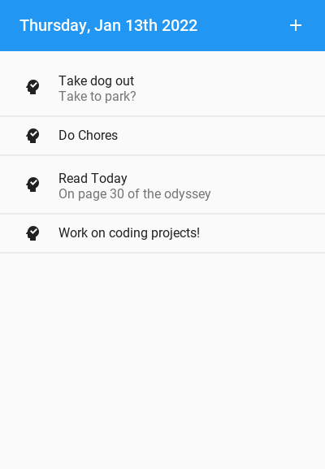
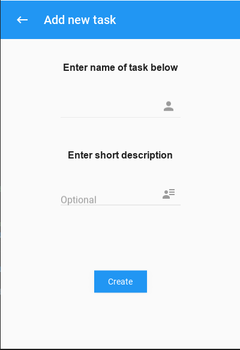

# Kivy-ToDo
 
 <pre>
    A simple kivy ToDo list created as a result of needing to track jobs and tasks for other projects

    Purpose:
        Whenever I sit down at my computer to work on projects, I have thousands of ideas running in my head of how
        I wish to change my application or add new functionality. Creating my own ToDo list made sure every time I sit down
        at my computer I add in all the tasks that I wish to complete for the day and work through them one at a time

    Features to add:
        1. Make list item check boxes to ensure users can check off their tasks through day (Future)
        2. Add functionality to delete and update entry items (Future)
        3. Create local file to save information between app close and relaunch (Future)
        4. Allow for drop down on click on list item, add more description (Future)
        5. Make more user friendly to eyes (Optional)
  </pre>

          